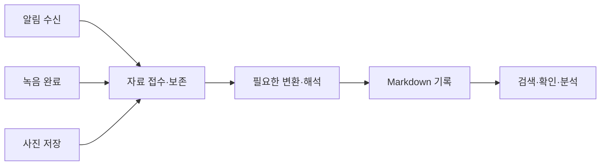

# Obsidian Mobile Capture

**휴대폰에서 생기는 알림·통화 녹음·사진을, 나중에 검색하고 AI로 활용할 수 있는 Markdown 기록으로 연결합니다.**

[English](README.md)

메시지로 받은 정보, 통화에서 정한 일, 사진으로 찍어 둔 문서. 휴대폰에는 유용한 자료가 쌓이지만 나중에 다시 옮기고 정리하려면 수고가 듭니다. 평소의 휴대폰 사용을 옵시디언 기록으로 이어 주면 이 수고를 줄일 수 있습니다.

이 저장소는 개인 환경에서 운영한 세 가지 자동화의 개념과 준비물을 소개합니다. 상세 코드와 설치 안내는 각 흐름을 다른 환경에서 재사용할 수 있도록 정리할 때 추가할 수 있습니다.

## 세 가지 기록 흐름

| 흐름 | 어떻게 연결하나요? | 무엇이 남나요? |
| --- | --- | --- |
| **알림 → 노트** | Tasker와 AutoNotification이 알림 내용을 받고, 스크립트가 분류 규칙에 따라 날짜별 Markdown으로 정리합니다. | 알림으로 받은 정보를 나중에 찾을 수 있는 기록. |
| **통화 녹음 → 전사·정리** | Termux가 완성된 녹음 파일을 감지합니다. 연결된 PC가 음성을 텍스트로 바꾸고, AI가 요약과 분류를 이어 갑니다. | 통화의 전사문, 요약, 후속 조치. |
| **사진 → 읽을 수 있는 기록** | Termux가 저장된 이미지를 감지합니다. AI가 내용을 설명하고 텍스트를 추출하며, 스크립트가 이미지와 결과를 정해진 정책에 따라 보존합니다. | 사진과 설명·추출된 텍스트가 연결된 기록. |

메시지 목록을 뒤지지 않고 배송 안내를 찾거나, 통화에서 정한 일을 다시 확인하거나, 촬영한 문서의 텍스트를 검색하는 데 활용할 수 있습니다. 이 예시들은 이해를 돕기 위해 새로 작성했으며 실제 개인 기록을 인용하지 않았습니다.

## 공통 원리

- **이미 하는 행동을 시작점으로 삼습니다.** 알림 수신과 파일 저장을 기록의 계기로 사용합니다.
- **해석하기 전에 자료를 보존합니다.** 원자료나 수집한 사본을 남겨 나중에 결과를 다시 확인할 수 있게 합니다.
- **의미를 이해해야 하는 곳에 AI를 사용합니다.** 전사, 사진 판독, 요약, 분류는 서로 다른 역할입니다. 알림의 기본 수집에는 AI가 필요하지 않습니다.
- **처리 단계를 나눕니다.** 완료한 결과를 남기면 뒤 단계의 실패 때문에 전사나 이미지 판독을 반복하는 일을 줄일 수 있습니다.
- **다시 활용할 수 있는 파일로 남깁니다.** Markdown과 연결된 자료를 옵시디언에서 읽고, 다른 도구로도 활용할 수 있습니다.

## 어떤 준비가 필요한가요?

필요한 도구는 흐름마다 다릅니다. 원하는 흐름 하나부터 선택하면 됩니다.

| 흐름 | 소개한 방식의 준비물 |
| --- | --- |
| 알림 | Android, Tasker·AutoNotification, 알림 접근·파일 기록 권한, Markdown 정리용 Termux·Python, 쓰기 가능한 볼트 폴더. |
| 통화 | 접근 가능한 녹음 파일을 저장하는 통화 앱, Termux·Python·오디오 처리 도구, faster-whisper 등의 PC 전사 서비스, Tailscale 연결, AI 요약 서비스, 쓰기 가능한 볼트 폴더. 소개한 GPU 전사 구성에는 NVIDIA GPU와 CUDA가 필요합니다. |
| 사진 | Android, Termux·Python과 파일 접근 권한, 이미지를 판독할 수 있는 AI 서비스, 쓰기 가능한 볼트 폴더. 참고 구성은 Termux 안의 Debian 환경과 인증된 Codex CLI를 사용합니다. |

통화 참고 구성도 Debian 환경의 Codex로 요약합니다. 재부팅 후 자동 시작이나 기기 간 볼트 동기화는 별도로 연결할 수 있습니다. 도구의 이용 조건, AI 계정, 필요한 연산 자원은 선택한 구성 요소에 따라 달라집니다.

## 내 환경에 맞추는 부분

입력 폴더, 저장 폴더, 분류 규칙, AI 연결 정보는 사용자 설정에 해당합니다. 공유할 핵심은 **어떤 사건을 받아 → 어떻게 처리하고 → 어떤 기록으로 남겨 → 나중에 어떻게 쓰는가**입니다.

알림의 참고 구현은 **카카오톡 알림 필드**를 해석합니다. 다른 앱에 적용하려면 그 앱의 알림 필드에 맞는 해석 규칙이 필요합니다. 알림 수집은 알림에 노출된 내용을 기록하며, 통화 흐름은 녹음 앱이 만든 접근 가능한 파일을 처리합니다.

## 현재 공개 범위

지금은 개념을 간략히 소개하는 문서 저장소입니다. 옵시디언 커뮤니티 플러그인과 별개이며, 바로 설치하는 자동화 패키지는 아직 제공하지 않습니다. 개인 환경에서 운영한 흐름을 바탕으로 설명하지만, 여러 기기에서의 호환성이나 공개 설치 절차를 검증했다는 의미는 아닙니다.

필요에 따라 흐름별 최소 코드, 설정 예제, 가상 입력·출력, 설치와 실패 복구 안내를 추가할 수 있습니다. 현재 저장소에는 새로 작성한 설명과 가상 활용 예시만 담으며, 개인 기록·기기 식별 정보·인증 정보·개인 파일 경로는 포함하지 않습니다.

## 구성에 사용하는 도구

[Tasker](https://tasker.joaoapps.com/) · [AutoNotification](https://joaoapps.com/autonotification/) · [Termux](https://github.com/termux/termux-app) · [Tailscale](https://tailscale.com/) · [faster-whisper](https://github.com/SYSTRAN/faster-whisper) · [Codex](https://github.com/openai/codex) · [Obsidian](https://obsidian.md/)
