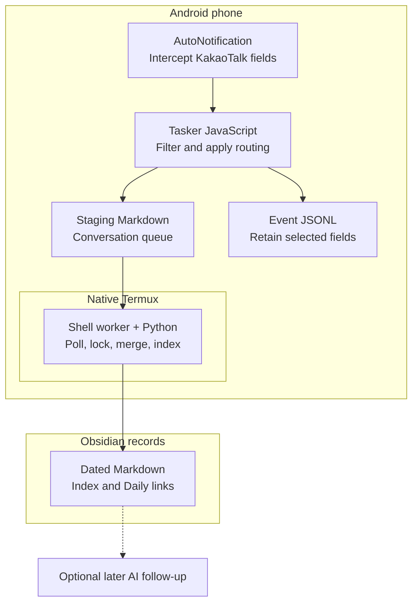
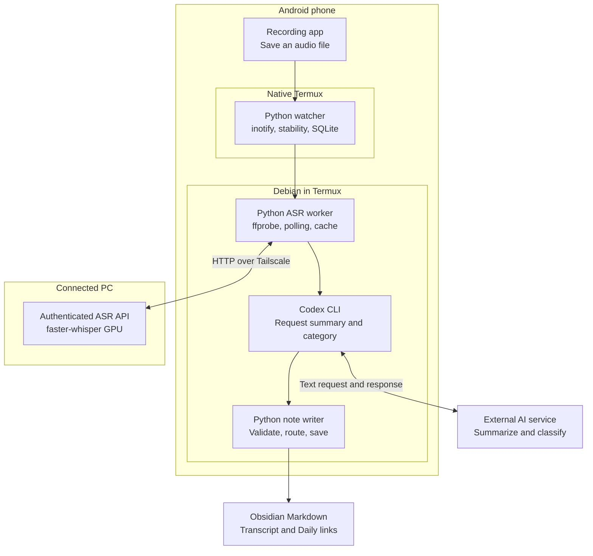
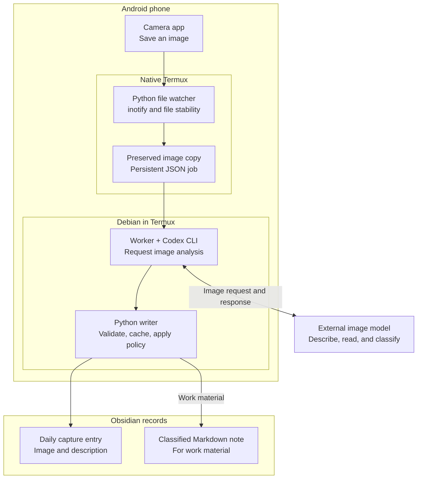

# Obsidian Mobile Capture

☕ **[Buy me a coffee](https://buymeacoffee.com/namsonghyun2)** — Your support is a big help in developing and improving this project.

**Turn everyday Android activity into Markdown you can search, revisit, and use with AI.**

Useful information arrives while you use your phone: a message notification, a call, a photo of a document. Saving and organizing it later takes effort. These workflows connect those existing actions to an Obsidian vault, so the information can become a useful record.

This repository introduces three workflows used in a personal environment. It starts with the concepts and prerequisites. Source code and step-by-step installation guides may be added as each workflow is prepared for reuse.

## Three ways to capture

| Workflow | What happens | What you can keep |
| --- | --- | --- |
| **Notifications → notes** | Tasker and AutoNotification capture notification text. Scripts apply routing rules and organize it into dated Markdown. | A searchable record of information received through notifications. |
| **Call recordings → transcripts** | Termux detects a completed recording. A connected PC transcribes it, then AI summarizes and organizes the result. | A transcript, summary, and follow-up items from a call. |
| **Photos → readable records** | Termux detects a saved image. AI describes it and extracts text; scripts preserve the image and write records according to the chosen policy. | A photo linked to its description or extracted text, ready to revisit. |

For example: find a delivery update without scrolling through messages, revisit an agreement from a call, or search text extracted from a photographed document. These are illustrative uses, not excerpts from personal records.

## How the workflows are implemented

The same capture idea uses different capabilities for each input. These diagrams show the tools, their responsibilities, and where processing happens in the reference workflows. Obsidian reads the resulting files; Python and JavaScript perform the recording and organization.

### 1. Notifications: intercept, preserve, organize

AutoNotification supplies notification fields to a Tasker task. Its external JavaScript filters events, identifies the conversation, and applies configured routing rules. Tasker writes the captured text first; a separate Termux worker organizes it afterward.

**Capabilities used:** notification interception, Tasker JavaScript actions, file appends, a polled work queue, and Python Markdown processing. The organizer reads staging Markdown, merges dated notes, updates the index, and records collection receipts and Daily Note links. JSONL is a retained event record. The basic capture path needs neither a PC nor an AI response.

### 2. Calls: queue on the phone, transcribe on the PC

A recording app creates the audio file. A native Termux watcher waits for a stable file and registers a persistent job. The worker validates the audio, connects to a PC transcription service through Tailscale, and uses the returned transcript for AI-assisted summaries.

**Capabilities used:** filesystem events and recovery scans, SQLite job persistence, `ffprobe` audio validation, authenticated HTTP over Tailscale, local faster-whisper inference, and Codex text analysis. The ASR client polls for results. Completed transcription and summary results can be reused when the source still matches, reducing repeated work after a later failure.

### 3. Photos: preserve the image, interpret, write records

The native Termux watcher detects a saved image and creates a preserved copy plus a JSON job. A Debian worker calls an image-capable AI service through Codex CLI. Python validates the returned fields and applies the storage policy.

**Capabilities used:** filesystem events, image preservation, persistent JSON job stages, AI image understanding and text extraction, and Python template-based writing. The AI returns content; Python writes the files. Saved analysis can be reused if writing fails. This path runs without Tasker or a PC; image inference is performed by the external model service. In the reference policy, work material receives a classified note, while ordinary photos still receive a daily capture entry.

### Shared principles

- **Start with an existing action.** Receiving a notification or saving a file becomes the trigger.
- **Preserve before interpreting.** Keep the source material or a captured copy available for later review.
- **Use AI where understanding helps.** Transcription, image interpretation, summaries, and classification have different roles. Basic notification capture can run without AI.
- **Keep processing stages separate.** Retained results help avoid repeating completed transcription or image analysis when a later step fails.
- **Store usable files.** Markdown records and linked assets can be opened in Obsidian and reused by other tools.

## What you would prepare

Each workflow has its own requirements. Choose one first.

| Workflow | Preparation for the described approach |
| --- | --- |
| Notifications | Android; Tasker and AutoNotification; notification and file access; Termux with Python for Markdown organization; a writable vault folder. |
| Calls | A recording app that saves accessible audio files; Termux with Python and audio utilities; a PC transcription service such as faster-whisper; Tailscale connectivity; an AI summarization service; a writable vault folder. The described GPU transcription route requires an NVIDIA GPU and CUDA. |
| Photos | Android; Termux with Python and file access; an AI service that can interpret images; a writable vault folder. The reference processing setup uses a Debian environment in Termux and an authenticated Codex CLI. |

The call reference also uses Codex in a Debian environment for summaries. Boot automation and cross-device vault synchronization can be added separately. Tool licenses, AI accounts, and compute requirements depend on the chosen components.

## Adapt the workflow to your environment

Source folders, destination folders, routing rules, and AI connections belong in user configuration. The reusable part is the relationship between **trigger → processing → saved result → later use**.

The notification reference handles **KakaoTalk notification fields**; another app needs its own field mapping. Notification capture preserves what the notification exposes. The call workflow processes existing recordings, so your recording app must create accessible files.

## Current scope

This is a concise workflow overview, separate from an Obsidian community plugin. It does not yet provide an installable automation package. The reference workflows have been operated in a personal setup; general device compatibility and public installation procedures are not claimed here.

Future documentation can add one workflow at a time: minimal scripts, configuration templates, synthetic sample outputs, and installation and recovery guides. This repository contains only newly written explanations and illustrative examples—no personal records, device identifiers, credentials, or private filesystem paths.

## Building blocks

[Tasker](https://tasker.joaoapps.com/) · [AutoNotification](https://joaoapps.com/autonotification/) · [Termux](https://github.com/termux/termux-app) · [Tailscale](https://tailscale.com/) · [faster-whisper](https://github.com/SYSTRAN/faster-whisper) · [Codex](https://github.com/openai/codex) · [Obsidian](https://obsidian.md/)
