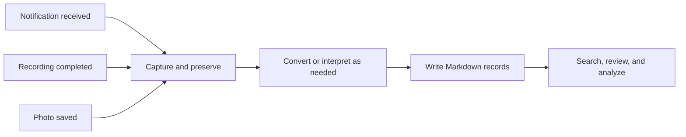

# Obsidian Mobile Capture

**Turn everyday Android activity into Markdown you can search, revisit, and use with AI.**

[한국어](README.ko.md)

Useful information arrives while you use your phone: a message notification, a call, a photo of a document. Saving and organizing it later takes effort. These workflows connect those existing actions to an Obsidian vault, so the information can become a useful record.

This repository introduces three workflows used in a personal environment. It starts with the concepts and prerequisites. Source code and step-by-step installation guides may be added as each workflow is prepared for reuse.

## Three ways to capture

| Workflow | What happens | What you can keep |
| --- | --- | --- |
| **Notifications → notes** | Tasker and AutoNotification capture notification text. Scripts apply routing rules and organize it into dated Markdown. | A searchable record of information received through notifications. |
| **Call recordings → transcripts** | Termux detects a completed recording. A connected PC transcribes it, then AI summarizes and organizes the result. | A transcript, summary, and follow-up items from a call. |
| **Photos → readable records** | Termux detects a saved image. AI describes it and extracts text; scripts preserve the image and write records according to the chosen policy. | A photo linked to its description or extracted text, ready to revisit. |

For example: find a delivery update without scrolling through messages, revisit an agreement from a call, or search text extracted from a photographed document. These are illustrative uses, not excerpts from personal records.

## One idea, three inputs

- **Start with an existing action.** Receiving a notification or saving a file becomes the trigger.
- **Preserve before interpreting.** Keep the source material or a captured copy available for later review.
- **Use AI where understanding helps.** Transcription, image interpretation, summaries, and classification have different roles. Basic notification capture can run without AI.
- **Keep processing stages separate.** Retained results help avoid repeating completed transcription or image analysis when a later step fails.
- **Store usable files.** Markdown records and linked assets can be opened in Obsidian and reused by other tools.

## What you would prepare

Each workflow has its own requirements. Choose one first.

| Workflow | Preparation for the described approach |
| --- | --- |
| Notifications | Android; Tasker and AutoNotification; notification and file access; Termux with Python for Markdown organization; a writable vault folder. |
| Calls | A recording app that saves accessible audio files; Termux with Python and audio utilities; a PC transcription service such as faster-whisper; Tailscale connectivity; an AI summarization service; a writable vault folder. The described GPU transcription route requires an NVIDIA GPU and CUDA. |
| Photos | Android; Termux with Python and file access; an AI service that can interpret images; a writable vault folder. The reference processing setup uses a Debian environment in Termux and an authenticated Codex CLI. |

The call reference also uses Codex in a Debian environment for summaries. Boot automation and cross-device vault synchronization can be added separately. Tool licenses, AI accounts, and compute requirements depend on the chosen components.

## Adapt the workflow to your environment

Source folders, destination folders, routing rules, and AI connections belong in user configuration. The reusable part is the relationship between **trigger → processing → saved result → later use**.

The notification reference handles **KakaoTalk notification fields**; another app needs its own field mapping. Notification capture preserves what the notification exposes. The call workflow processes existing recordings, so your recording app must create accessible files.

## Current scope

This is a concise workflow overview, separate from an Obsidian community plugin. It does not yet provide an installable automation package. The reference workflows have been operated in a personal setup; general device compatibility and public installation procedures are not claimed here.

Future documentation can add one workflow at a time: minimal scripts, configuration templates, synthetic sample outputs, and installation and recovery guides. This repository contains only newly written explanations and illustrative examples—no personal records, device identifiers, credentials, or private filesystem paths.

## Building blocks

[Tasker](https://tasker.joaoapps.com/) · [AutoNotification](https://joaoapps.com/autonotification/) · [Termux](https://github.com/termux/termux-app) · [Tailscale](https://tailscale.com/) · [faster-whisper](https://github.com/SYSTRAN/faster-whisper) · [Codex](https://github.com/openai/codex) · [Obsidian](https://obsidian.md/)
